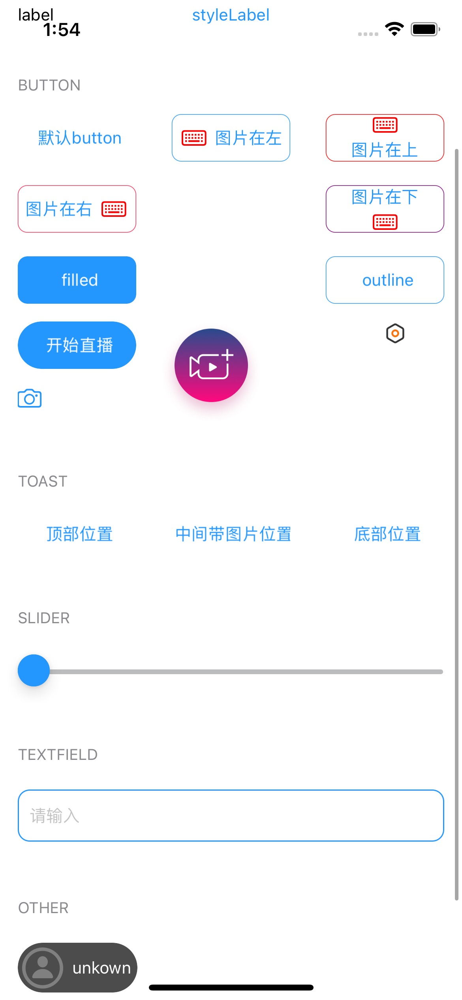

# 效果图



<br/>

***

# 公共属性

### TextColorStyle

|ColorType|颜色|
|--|--|
|black|#000000|
|disabled|#BABCBD|
|white|#FFFFFFF|
|primary|#2397FE|
|error|#FA2D5C|
|warning|#F7AF32|

<br/>

### TextFontStyle

|FontType|fontSize|字体|
|:--|:--|--|
|small|12|Heiti SC.Heiti 简体中文|
|middle|14|Heiti SC.Heiti 简体中文|
|large|16|Heiti SC.Heiti 简体中文|

<br/>

# AGELabel和AGEButton公共属性

#### 公开属性

```swift
// 颜色设置, 默认black
var colorStyle: AGETextColorStyle = .black
```

```swift
//字体设置, 默认14
var fontStyle: AGETextFontStyle = .font14
```

```swift
// 圆角设置
var cornerRadius: CGFloat = 0
// 设置某个为圆角
var maskedCorners: CACornerMask?
```

```swift
// 边框设置
var borderWidth: CGFloat = 0
var borderColor: UIColor = .clear
```

```swift
// 阴影设置
var shadowPath: CGPath?
var shadowColor: UIColor?
var shadowOffset: CGSize
var shadowRadius: CGFloat = 0 
var shadowOpacity: Float = 0
```

<br/>

# AGELabel

### 初始化方法

```swift
init(colorStyle: AGETextColorStyle = .black,
     fontStyle: AGETextFontStyle = .font14)
```

### 默认值

```swift
// 字体默认
font = fontStyle.font14
// 文字颜色默认主题色
textColor = .primary
```

# AGEButton

### 按钮样式

|类型|描述|圆角|
|--|--|--|
|filled(backgroundColor: UIColor?)|填充背景色,默认主题色|8|
|outline(borderColor: UIColor?)|带边框的按钮, 默认主题色|8|
|createLive|创建直播的按钮||
|startLive|开始直播的按钮, 默认主题色, 宽100, 高40|20|
|switchCamera(imageColor: UIColor?)|切换摄像头,可设置图片颜色||
|setting|设置按钮,默认锯齿图片||
|delete(imageColor: UIColor?)|删除按钮,  可设置图片颜色||
|mic(imageColor: UIColor?)|麦克风按钮, 可设置图片颜色||
|muteMic(imageColor: UIColor?)|静音麦克风按钮, 可设置图片颜色||
|play(imageColor: UIColor?)|播放按钮, 可设置图片颜色||
|pause(imageColor: UIColor?)|暂停按钮, 可设置图片颜色||
|none|默认样式, 字体颜色主题色|10|

<br/>

#### 按钮点击闭包回调

```swift
var onClickButtonClosure: ((UIButton) -> Void)?
```

#### 设置属性

```swift
// 样式设置
var buttonStyle: AGEButtonStyle = .none
```

```swift
// 图片size设置
var imageSize: CGSize?
```

#### 设置图片位置

|类型|描述|
|--|--|
|top|图片在上|
|left|图片在左|
|right|图片在右|
|bottom|图片在下|

```swift
// 设置图片位置和间距
func setImage(_ image: UIImage?,
                  for state: UIControl.State,
                  postion: ImagePosition,
                  spacing: CGFloat = 5)
```

#### 初始化方法

```swift
init(style: AGEButtonStyle = .none,
         colorStyle: AGETextColorStyle? = nil,
         fontStyle: AGETextFontStyle? = nil)
```

#### 图片旋转

```swift
/// 旋转向上
open func rotateUp()

/// 旋转向下
open func rotateDown()
```

# AGEImageView

### 公共图片

|类型|描述|
|--|--|
|avatar|头像|
|placeHolder|占位图|

### 初始化方法

```swift
init(type: AGEImageType)
```

```swift
init(systemName: String)
```

```swift
init(imageName: String)
```

#### 默认属性

```swift
contentMode = .scaleAspectFit
cornerRadius = 5
isUserInteractionEnabled = true
```

# AGETextField

### 初始化方法

```swift
init(colorStyle: AGETextColorStyle = .black, fontStyle: AGETextFontStyle = .font14)
```

#### 默认属性

```swift
// 提示文字
plaplceholder = "请输入"
// 默认14号简体中文
font = .systemFont(ofSize: 14)
// 圆角10
cornerRadius = 10
// 边框颜色 主题色
borderColor = .blueColor
// 边框宽: 1
borderWidth = 1
// 字体颜色 黑色
textColor = .black
// 光标距离左边距离: 10
leftView = UIView(frame: CGRect(x: 10, y: 0, width: 10, height: 0))
```

# AGESlider

#### 默认属性

```swift
// 滑块左边（小于部分）线条的颜色
minimumTrackTintColor = .blueColor
// 滑块右边（大于部分）线条的颜色
maximumTrackTintColor = .textOnAccent
// 滑块颜色（影响已划过一端的颜色）
thumbTintColor = .blueColor
```

# AGETableView 和 AGECollectionView 公用

##### 下拉刷新功能

```swift
// 是否在刷新中
var isRefreshing: Bool
```

```swift
// 添加刷新功能
func addRefresh()
```

```swift
// 开始刷新
func beginRefreshing()
```

```swift
// 结束刷新
func endRefreshing()
```

```swift
// 空界面提示文字
var emptyTitle: String?
```

```swift
// 空界面占位图
var emptyImage: UIImage?
```

# AGETableView

### 事件代理 AGETableViewDelegate

```swift
 // 返回UITableViewCell
 func tableView(_ tableView: UITableView, cellForRowAt indexPath: IndexPath) -> UITableViewCell
 
 // cell点击事件
 @objc optional func tableView(_ tableView: UITableView, didSelectRowAt indexPath: IndexPath)
 // 下拉刷新事件
 @objc optional func pullToRefreshHandler()
 // headerSectionView
 @objc optional func tableView(_ tableView: UITableView, viewForHeaderInSection section: Int) -> UIView?
 // section 标题
 @objc optional func tableView(_ tableView: UITableView, titleForHeaderInSection section: Int) -> String?
```

##### 行高

```swift
// 行高
var rowHeight: CGFloat = 0
// 预估行高
var estimatedRowHeight: CGFloat = 0
```

##### 数据源,必须赋值

```swift
var dataArray: [Any]?
// 刷新
func reloadData()
```

##### cell分割线

```swift
var separatorStyle: UITableViewCell.SeparatorStyle = .none
```

##### tableHeaderView

```swift
var headerView: UIView?
```

##### 注册cell

```swift
func register(_ cellClass: AnyClass?, forCellWithReuseIdentifier identifier: String)
func register(_ nib: UINib?, forCellWithReuseIdentifier identifier: String)
```

##### 底部插入Cell

```swift
// 传入数据
func insertBottomRow(item: Any?)
```

##### 初始化方法

```swift
init(frame: CGRect, style: UITableView.Style)
```

```swift
init(frame: CGRect)
```

```swift
init()
```

# AGECollectionView

##### 事件代理 AGECollectionViewDelegate

```swift
// collectionViewCell
func collectionView(_ collectionView: UICollectionView, cellForItemAt indexPath: IndexPath) -> UICollectionViewCell
// cell点击事件
@objc optional func collectionView(_ collectionView: UICollectionView, didSelectItemAt indexPath: IndexPath)
// 下拉刷新事件
@objc optional func pullToRefreshHandler()
```

##### 属性设置

```swift
// cell大小设置
var itemSize: CGSize = .zero
// 预估cell大小
var estimatedItemSize: CGSize = .zero
// cell内边距设置
var edge: UIEdgeInsets = .zero
// 行间距
var minLineSpacing: CGFloat = 0
// 列间距
var minInteritemSpacing: CGFloat = 0
// 滚动方向
var scrollDirection: UICollectionView.ScrollDirection = .horizontal
// 分页滚动
var isPagingEnabled: Bool = false
// 是否滚动
var isScrollEnabled: Bool = true
```

##### 数据源

```swift
 // 数据源,必须赋值
 var dataArray: [Any]?
 // 刷新
 func reloadData()
```

##### 注册Cell

```swift
func register(_ cellClass: AnyClass?, forCellWithReuseIdentifier identifier: String)

func register(_ nib: UINib?, forCellWithReuseIdentifier identifier: String)
```

##### 初始化方法

```swift
init()
```

```swift
init(frame: CGRect)
```

# AGELiveAvatarButton

#### 赋值

```swift
func setName(with avatar: UIImage?, name: String) 
```
